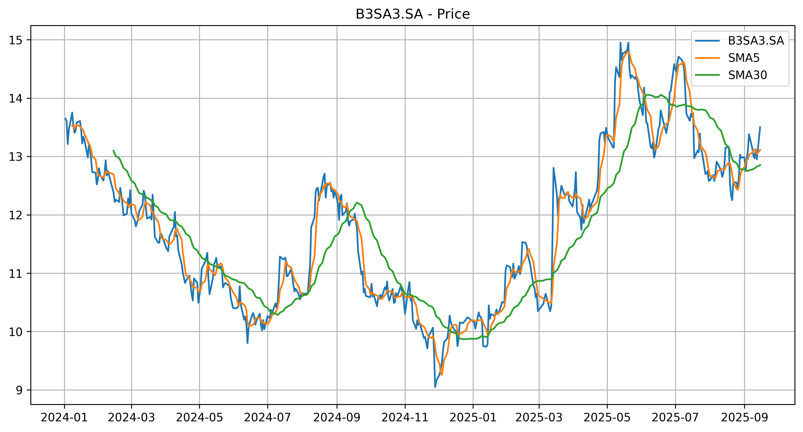
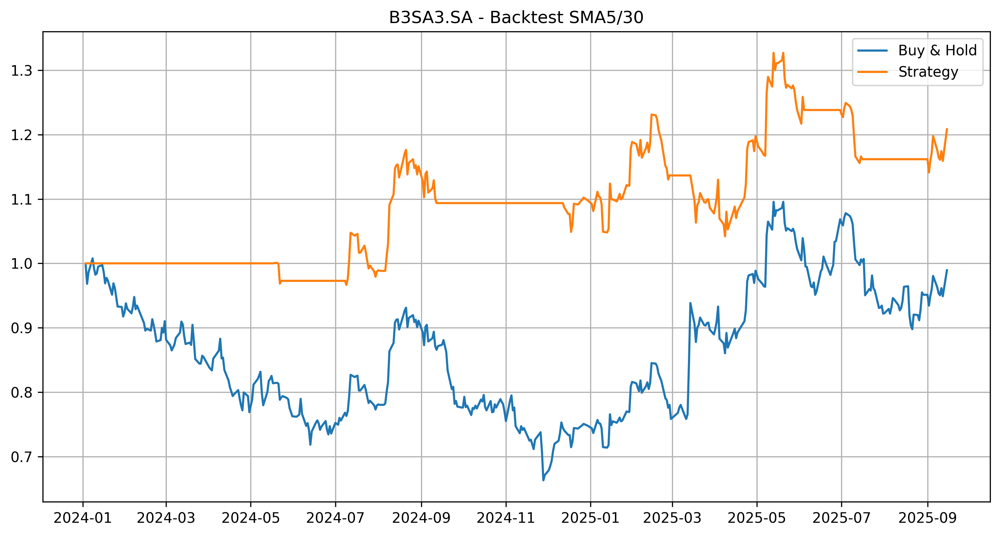
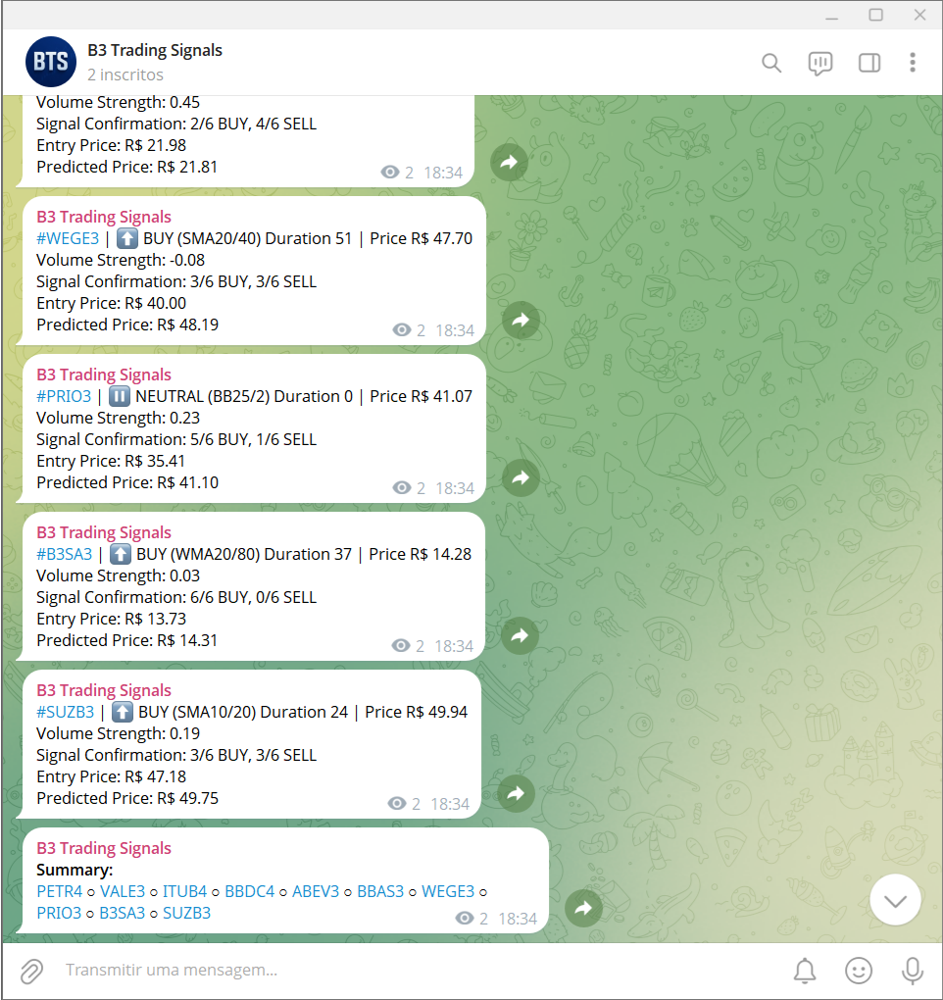

# Sinais de negociação B3

Este projeto disponibiliza um script Python para **geração automática de sinais de compra e venda de ativos da B3 (Bolsa de Valores Brasileira)**, aplicando estratégias com indicadores técnicos em séries temporais do mercado à vista. Inclui um script para ***backtesting* e seleção das estratégias com melhor desempenho**, permitindo avaliar as abordagens antes de aplicá-las.

Como principais vantagens, o projeto proporciona:
- envio de **sinais de negociação recorrentes via canal no Telegram** e que **evitem a necessidade de análise gráfica**.
- uso de **aprendizado de máquina** para a geração de sinal de confirmação.
- **código aberto** permitindo **flexibilidade para escolha e parametrização dos indicadores** e comparação entre estratégias.

Canal Telegram aberto com sinais diários executado via GitHub Actions, onde todos podem se inscrever para uma impressão do que o *bot* pode oferecer:
[t.me/b3_trading_signals_free](https://t.me/b3_trading_signals_free)

## 📊 Funcionalidades

- **Download de dados**: Realiza o download de dados de mercado pela API Yahoo Finance.
- **Estratégias via indicadores técnicos**: Implementa estratégias de cruzamento de 2 ou 3 médias móveis (SMA, WMA ou EMA), bandas de Bollinger (BB), média móvel de convergência/divergência (MACD), a fim de identificar possíveis tendências.
- ***Backtesting* das estratégias**: Realiza teste das estratégias com dados históricos, gerando figuras e resumo para tomada de decisão.
- **Avaliação de performance**: Avalia desempenho frente a uma função objetivo de ponderação e classifica as melhores estratégias.
- **Previsão do preço futuro**: Realiza predições baseadas em aprendizado de máquina supervisionado, aplicando algoritmos regressores como *gradient boosting* e *random forest*.
- **Notificações via Telegram**: Envia sinais de negociação provenientes da estratégia escolhida diretamente para o *smartphone*/computador.
- **Agendamento automático**: Configura tarefa para execução recorrente via GitHub Actions ou então pelo Agendador de Tarefas do Windows.
- **Arquivos de configuração**: Utiliza `.env` para variáveis de ambiente privadas, `.json` para parâmetros de configuração, `.txt` para lista de códigos, `.txt`para lista de indicadores e `.csv` para lista de estratégias.

## 📈 Estratégias Disponíveis

O projeto suporta estratégias baseadas nos seguintes indicadores:
- **cruzamento de duas e três médias móveis** usando:
  - **SMA (Simple Moving Average)** - Média móvel simples.
  - **EMA (Exponential Moving Average)** - Média móvel exponencial.
  - **WMA (Weighted Moving Average)** – Média móvel ponderada.
- **bandas de Bollinger**;
- **média móvel de convergência/divergência**.

## 🧩 Estrutura

O projeto é organizado em torno de uma arquitetura modular, onde cada classe tem uma responsabilidade:
- **Loader** gerencia arquivos de configuração do mercado.
- **Indicator** gera os indicadores técnicos.
- **Backtester** executa sinais de negociação nos dados históricos e calcula métricas de desempenho.
- **Forecaster** gera previsões do preço futuro.
- **Strategies** gera pontuação e classifica estratégias com base em função objetivo configurável.
- **Exporter** exporta resultados para planilhas.
- **Notifier** envia notificações por aplicativo.

O projeto possui a seguinte estrutura:

 ```text
 b3_trading_signals/ 
 │  
 ├── b3_trading_signals.py 
 ├── b3_trading_signals_bot.py 
 ├── b3_trading_signals_task_scheduler.py 
 |  
 ├── core/   
 │   ├── __init__.py  
 │   ├── loader.py  
 │   ├── indicator.py  
 │   ├── backtester.py  
 │   ├── forecaster.py  
 │   ├── strategies.py    
 │   ├── exporter.py  
 │   └── notifier.py  
 │  
 ├── config/  
 │   ├── config.json  
 │   ├── tickers.json  
 │   └── indicators.json    
 │  
 ├── data/  
 │   ├── debug/  
 │   ├── report/  
 │   └── results/ 
 |       ├── best_results.xlsx 
 │       ├── strategies.csv  
 │       └── backtests.png    
 │  
 ├── images/  
 ├── requirements.txt  
 ├── README.md  
 └── LICENSE  
 ```

## ⚙️ Como Usar

1. **Instalar dependências**:
   ```bash
    pip install pandas
    pip install numpy
    pip install yfinance
    pip install requests
    pip install python-dotenv
    pip install scikit-learn
    ```

2. **Configurar códigos e indicadores**
   - Em `config.json` altere os parâmetros de configuração.
   - Em `tickers.txt` adicione os códigos das ações que deseja avaliar, um por linha.
   - Em `indicators.txt` adicione os indicadores que deseja gerar, um por linha.
   - Em `strategies.csv` são salvos os códigos das ações que deseja gerar sinais de negociação, cada qual com a respectiva melhor estratégia.

3. **Configurar Telegram**
   - Crie um *bot* no Telegram e obtenha o seu `TOKEN`.
   - Crie um canal no Telegram e obtenha o seu `CHAT_ID`.
   - Adicione o *bot* como administrador do canal.
   - Adicione as chaves em `.env` para serem lidas pelo `b3_trading_signals_bot.py`.

4. **Executar o script**
   - Para rodar a batelada de *backtests* execute:
     ```bash
     python b3_trading_signals.py
     ```
   - Para geração de sinais e notificação, para cada *ticker*, execute:
     ```bash
     python b3_trading_signals_bot.py
     ```
   - Para automatizar a geração de sinais com GitHub Actions, crie os *repository secrets* `TOKEN` e `CHAT_ID`, para o *workflow* já configurado. Alternativamente, para agendar tarefa somente pelo Windows, execute uma única vez:
     ```bash
     python b3_trading_signals_task_scheduler.py
     ```

## 🖼️ Exemplos de saídas

- **Gráfico do *backtest* com SMA**
  
  Após a execução do script `b3_trading_signals.py` são gerados gráficos de cada estratégia, planilhas para cada *ticker*, planilha com melhores resultados. As figuras geradas seguem o exemplo mostrado abaixo:
  <p align="center">
    
    
  </p>

  Note como o ativo encerra o período avaliado próximo ao valor inicial, de modo que a estratégia *Buy & hold* resultaria em retorno nulo. Por outro lado, caso a estratégia SMA 5/30 fosse seguida à risca proporcionaria ao final do período um retorno de 20% sobre o valor investido, desconsiderando taxas de negociação. Ademais, a operação de venda a descoberto foi desconsiderada nos cálculos devido as taxas de aluguel envolvidas, embora possa facilmente ser habilitada no *backtest*.

- **Sinal de negociação via Telegram**

  Após a execução do script `b3_trading_signals_bot.py` são gerados sinais de negociação para as melhores estratégias escolhidas, seguindo o exemplo mostrado abaixo:
  <p align="center">
    
  </p>

  Note como é gerado um sinal de negociação para cada ativo, sugerindo a tendência de alta, baixa ou neutralidade baseado na estratégia escolhida e a duração dessa tendência, que mostra a quantas amostras a tendência permanece sem trocar de lado. Adicionalmente, são mostrados dados de volume e das principais médias móveis como indicadores de força dessa tendência.

## 📌 Observações

⚠️ Não nos responsabilizamos por perdas ou prejuízos resultantes do uso das estratégias ou sinais gerados por este código.

- Contribuições são bem-vindas! Abra uma *issue* ou envie um *pull request*.
- Novas melhorias e funcionalidades poderão ser incorporadas no futuro. Estão planejadas:
  - alteração para o paradigma de orientação a objeto (POO); ✅
  - melhoria na função objetivo com novas ponderações e *presets*; ✅
  - predição de preço futuro via árvores de decisão; ✅
  - mais indicadores para o preço e estratégias; ✅
  - alertas/relatório por e-mail.
- Sobre bases de dados:
  - API Yahoo Finance: latência de 15 minutos para dados intradiários, sem limite de requisições;
  - API Brapi em seu plano gratuito: latência de 30 minutos, limite mensal de 15000 requisições;
  - Outras APIs: latências similares e/ou envolvem custo.

## 🚀 Versão Premium

A versão Premium desbloqueia recursos avançados para automação e notificações profissionais. Veja acomparação das funcionalidades:

| Funcionalidade            | Free | Premium |
|---------------------------|-------|------|
| Backtest                  |  ✅  |  ✅  |
| Avaliação das estratégias |  ✅  |  ✅  |
| Notificações Telegram     |  ✅  |  ✅  |
| Notificações WhatsApp     |  ❌  |  ✅  |
| Relatório Gmail           |  ❌  |  ✅  |

Se esse projeto o ajudou, considere adquirir a versão Premium:   
👉 https://payhip.com/b/PU9tc  


